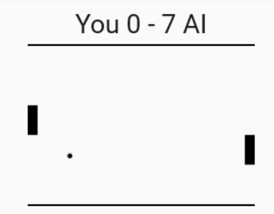
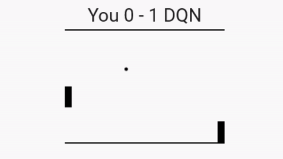
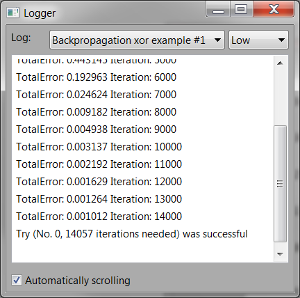
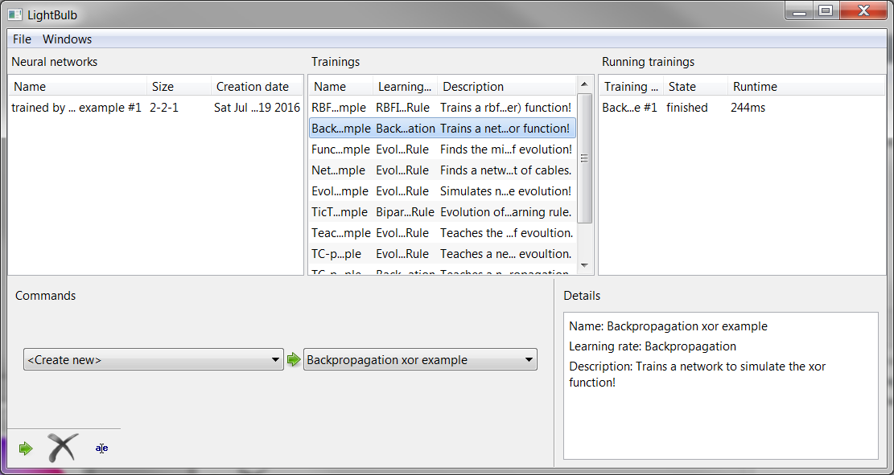
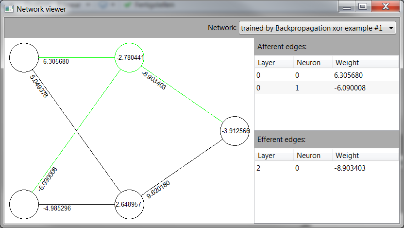
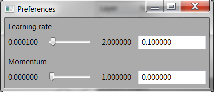
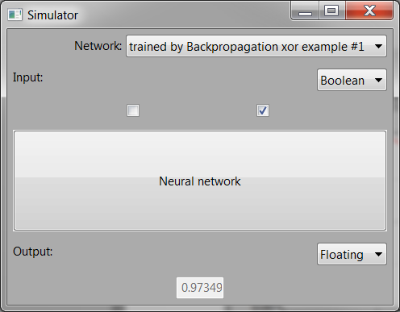

# LightBulb

[](https://travis-ci.org/domin1101/LightBulb)

LightBulb is a machine learning framework written in C++ which focuses on unsupervised learning.

## Implemented features

* Basic supervised learning (Gradient descent with multiple extensions like RMSProp)
* Evolutionary algorithms (including Coevolution)
* Reinforcement learning (DQN and Policy Gradient learning)
* LightBulbApp as integrated GUI for LightBulb
* Serialization for saving and loading networks and learning process

## Try it!

LightBulbExample is a demo project which uses LightBulb to demonstrate some basic learning examples like learning Pong or TicTacToe.

### Windows:

Just download the [binary](https://github.com/domin1101/LightBulb/releases/download/v0.1/LightBulb-v0.1-win32.zip) from the v0.1 release.

### Linux & Other

You can use cmake to build LightBulb and LightBulbExample:

Dependencies of LightBulb are:
* wxWidgets (v3.1) ([Read how to install](docs/wxwidgets.md))

```bash
mkdir build
cd build
cmake ..
make
example/LightBulbExample/LightBulbExample
```

Read more about [building](docs/build.md).

## Impressions

<a href="http://dw-projects.com/index.php?id=58">
<p >

</p>
</a>

An AI which learned to play pong with the help of coevolution.

<a href="http://dw-projects.com/index.php?id=58">
<p >

</p>
</a>

An AI which learned to play pong with the help of DQN.

Screenshots of the LightBulbApp:












## Getting started

[Getting started](docs/getting_started.md) for developing.

## Examples & Tutorials

There are currently [four examples](docs/examples_overview.md) which cover the basic usage of LightBulb.

## Reference manuals

LightBulb is fully [documented](http://docs.dw-projects.com/LightBulb/namespace_light_bulb.html).
