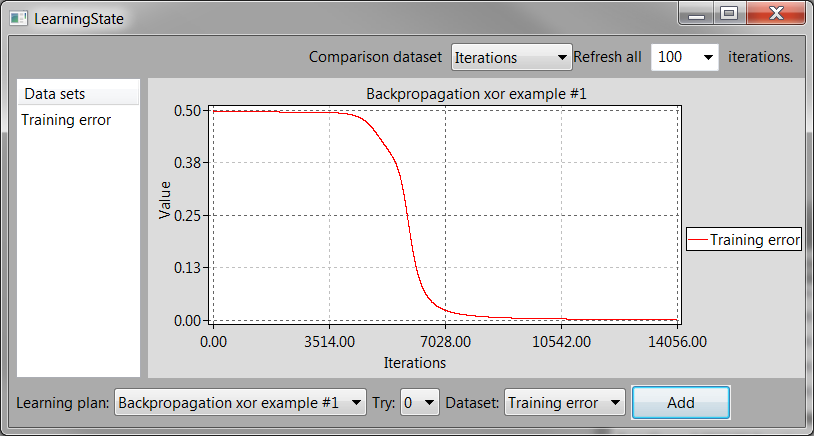

# LightBulb

[](https://travis-ci.org/domin1101/LightBulb)

LightBulb is a machine learning framework written in C++ which focuses on unsupervised learning.

## Implemented features

* Basic supervised learning (Gradient descent with multiple extensions like RMSProp)
* Evolutionary algorithms (including Coevolution)
* Reinforcement learning (DQN and Policy Gradient learning)
* LightBulbApp as integrated GUI for LightBulb
* Serialization for saving and loading networks and learning process

## Try it!

LightBulbExample is a demo project which uses LightBulb to demonstrate some basic learning examples like learning Pong or TicTacToe.

### Windows:

Just start the correct binary in the "bin" directory.

### Linux & Other

You can use cmake to build LightBulb and LightBulbExample:

Dependencies of LightBulb are:
* wxWidgets (v3.1) ([Read how to install](docs/wxwidgets.md))

```bash
mkdir build
cd build
cmake ..
```
## Impressions



## Examples & Tutorials

There are currently [four examples](docs/examples_overview.md) which cover the basic usage of LightBulb.